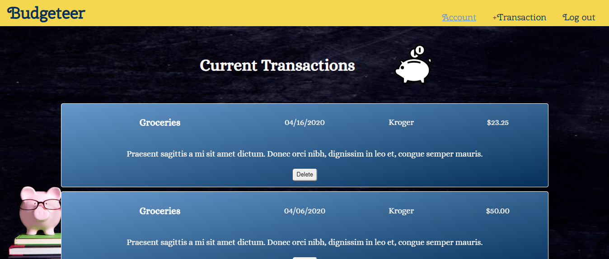

# Budgeteer

## Introduction
Budgeteer is an experimental React application for expense tracking. 
Budgeteer utilizes authentication for accounts, allowing users to categorize, date and record expenses.


#### Click [here](https://budgeteer-app.now.sh/) to test out the app 

### How it works
There is a landing page for all first time and returning users. Any new users can register with a username and password.
Returning users can input their credentials to return to their protected account. 
Adding a transaction pops up a modal that asks for a category, date, cost, and optional payees and memos for the transaction.





## Getting Started with the Client
### Installing
Clone the repository and download dependencies.
```
$ git clone https://github.com/jmw7/budgeteer-client.git
$ cd recipe-client
$ npm install
```

### Launching
Start development server
```
$ npm run dev
```
This will automatically open a browser window with the project

### Testing
Run tests with Jest and Enzyme
```
$ npm run test
```

## Database
To access the database use the URL below to connect to the client
 - https://calm-taiga-41329.herokuapp.com

### Methods
  GET || POST || DELETE

### Parameters
 - /api/authentication
 - /api/users/
 - /api/:accountId

### Response
 - Post success response: 201
 - Delete success response: 204
 - Post error response: 400
 - Authentication errror response: 401
 - Not found error response: 404

## Built with
 - [CSS3](https://developer.mozilla.org/en-US/docs/Web/CSS/CSS3)
 - [React](https://reactjs.org/)
 - [Node.js](https://nodejs.org/en/)
 - [PostgreSQL](https://www.postgresql.org/)
 - [Knex.js](http://knexjs.org/)

 ## Images
 - "[Justice]"(https://thenounproject.com/scribble.liners/collection/finance/?i=2044978) by Scribble.liners from [the Noun Project] (https://thenounproject.com/)
 - "[Budgeting]"(https://thenounproject.com/term/budgeting/2009557/) by Scribble.liners from [the Noun Project] (https://thenounproject.com/)
 - "[Chart]"(https://thenounproject.com/term/chart/1970984/) by Scribble.liners from [the Noun Project] (https://thenounproject.com/)
 - "[Piggy Bank]"(https://thenounproject.com/search/?q=piggy%20bank&i=2976170) by alison from [the Noun Project] (https://thenounproject.com/)
 - [Piggy Bank - background](https://downpaymentresource.com/wp-content/uploads/2017/04/iStock-508660880-e1492534133806.jpg)
- [Fist of money](https://www.clipart.email/download/1316317.html)